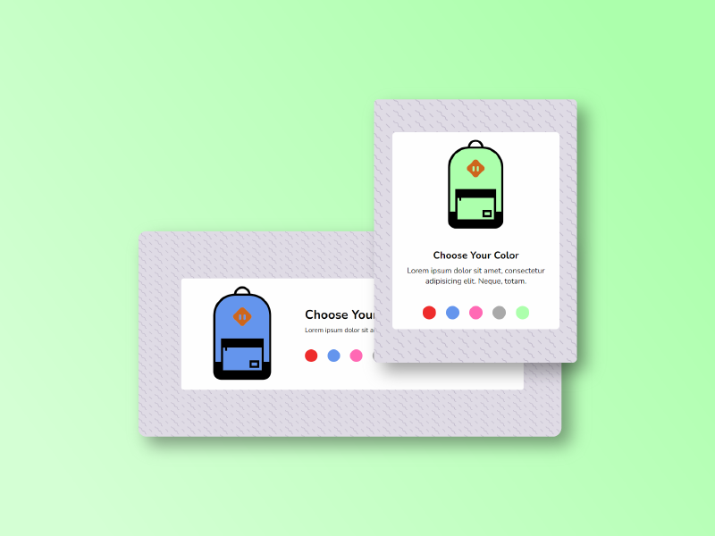

# BACKPACK CONFIGURATOR

## A simple backpack color configurator made with HTML, CSS and vanilla JS.

#### This mini project is inspired by this [tutorial](https://www.youtube.com/watch?v=WVJLrbiMKhM&t=147s) from **_CODING IN PUBLIC_**.